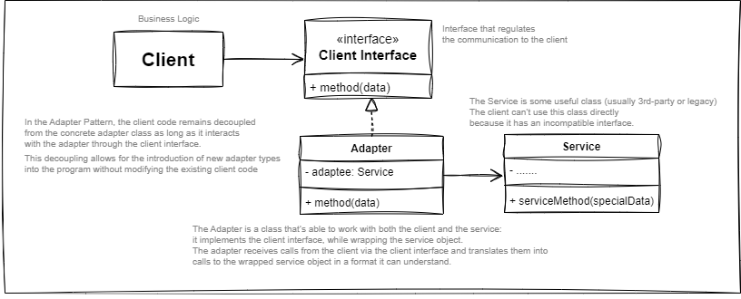
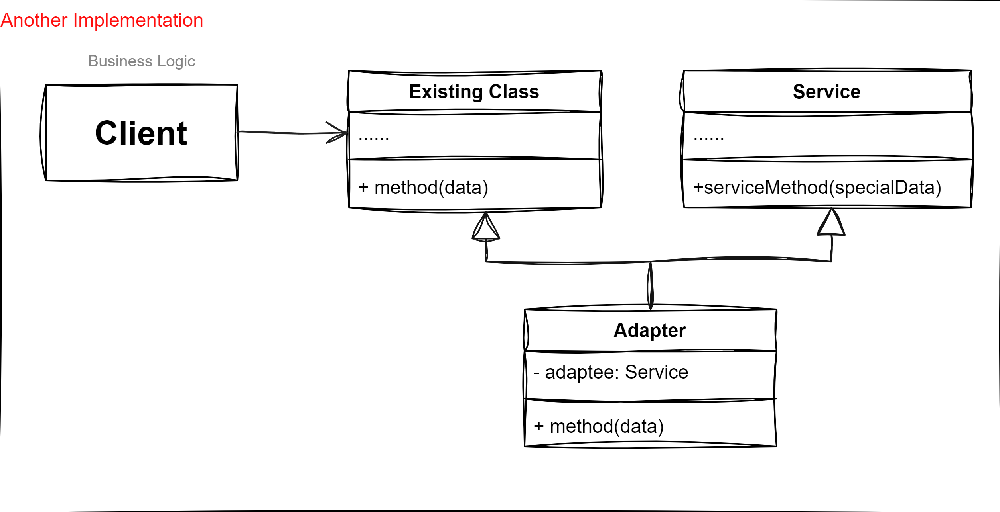
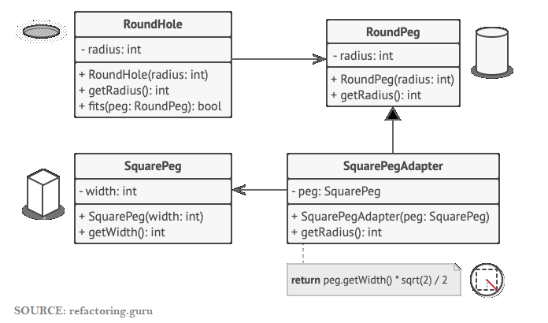

# Table of content

1. [Introduction](#adapter-pattern)
2. [When to use](#when-to-use)
3. [When not to use](#when-not-to-use)

 --------

## Adapter Pattern 🧩

**Adapter** is a ***structural design pattern*** that allows objects with incompatible interfaces to collaborate.

**How it works:**
1. The **adapter** gets an interface, compatible with one of the existing objects (client).

2. Using this interface, the existing object (client) can safely call the adapter’s methods.

3. Upon receiving a call, the adapter passes the request to the second object, but in a format and order that the second object expects.

**Adapter Pattern Implementation:**

  
 **Another Adapter pattern Implementation:**

## When to use:✅

-  **Legacy Code and 3rd-Party libraries integrations:** Use the Adapter Pattern when you need to integrate legacy code or working with third-party libraries or APIs that have incompatible interfaces into a your system. The adapter allows the external code to interact with your system without modification.

-  **Interface Standardization:** If you have multiple classes with different interfaces but similar functionality, adapters can standardize the way these classes are used, providing a uniform interface for clients.

-  **Plug-in Architecture:** In systems designed to support plug-ins or modules, adapters can facilitate the interaction between the core system and external plug-ins, ensuring compatibility.

-  **Testing and Mocking:** During unit testing, adapters can be used to wrap and mock complex objects or external systems, simplifying the testing process and allowing you to simulate various scenarios.

  

## When not to use:❌

-  **Unnecessary Complexity:** Avoid using the Adapter Pattern if the system's existing interfaces are already compatible or maybe it’s simpler just to change the service class so that it matches the rest of your code.

- Introducing an adapter unnecessarily adds complexity without providing any real benefit. *(choose your trade-offs)*

-  **Performance Concerns:** Adapters introduce an additional layer of abstraction, which can impact performance. In performance-critical applications, this added overhead might be unacceptable.

-  **Simple Wrapping:** If the adaptation involves only minor changes and can be handled by simple method wrapping or delegation without introducing a full-fledged adapter, prefer the simpler approach.

## Example

