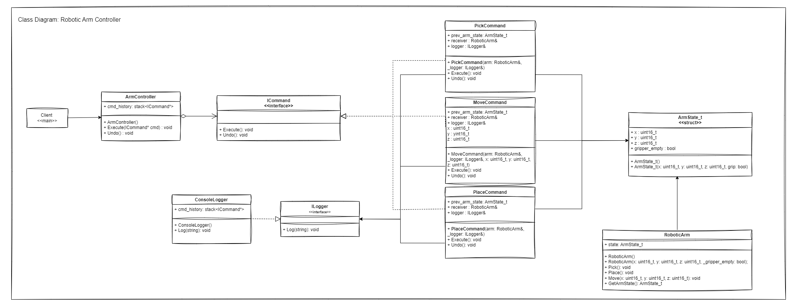

# USE CASE: Robotic Arm Control System

1. [Requirements](#requirements)
2. [Class diagram](#class-diagram)
----
### Requirements
The client requires a control system for a robotic arm used in a manufacturing assembly line. The system must support essential operations like:
	- Moving the arm to specific positions
	- Picking up items
	- Placing items
	- Additionally, the system should log operations
	- Support undo functionality for the last few actions

##### Control Robotic Arm:
1. **Move Arm to Position:**
	- The system must allow the robotic arm to move to a specified 3D coordinate (x, y, z).
		- *Example: Move the arm to position (10, 20, 30).*

2. **Pick Up Item:**
	- The system should command the robotic arm to pick up an item from its current position.
		- *Example: Pick up the item located at the arm's current coordinates.*

3. **Place Item:**
	- The system should allow the robotic arm to place an item at a specified 3D coordinate (x, y, z).
		- *Example: Place the item at position (40, 50, 60).*

4. **Logging Operations:**
	- The system must log each operation performed for debugging and user review purposes.
	- The logs should include details of the command executed, the parameters involved, and a timestamp.
		- *Example: Log the details when the arm moves to a new position, picks up an item, places an item.*

5. **Undo Functionality:**
	- The system must support undoing the last performed action.
	- The undo action should revert the arm to its previous state before the last command was executed.
		- *Example: If the last action was moving the arm to position (10, 20, 30), the undo should move the arm back to its previous position.*

---
### Class Diagram
