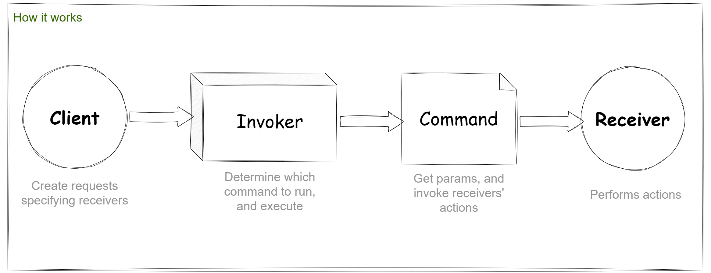
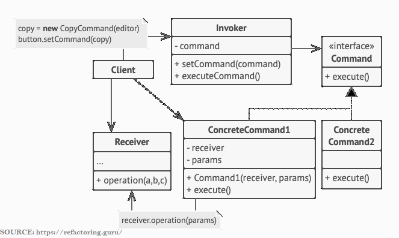
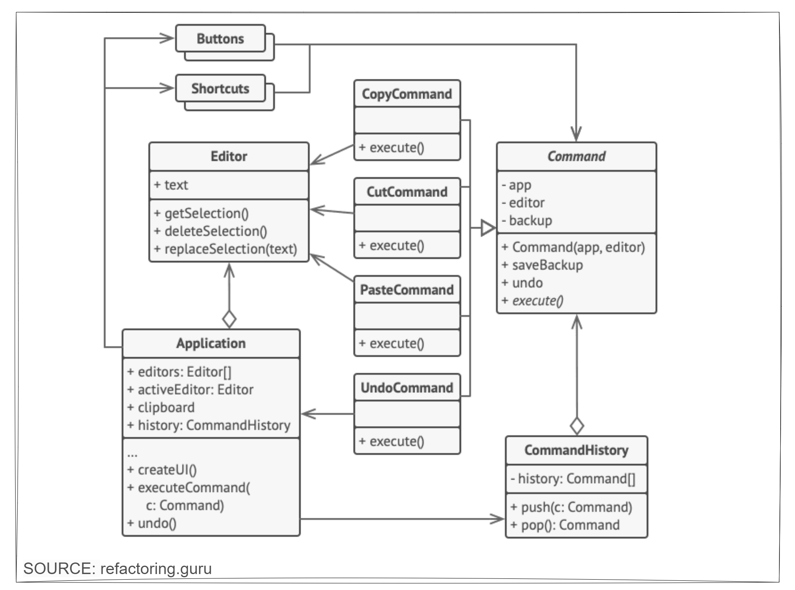

# Table of content

1. [Introduction](#command-pattern)
2. [When to use](#when-to-use)
3. [When not to use](#when-not-to-use)
4. [Example](#example)

 --------

## Command Pattern📃

The **Command Design Pattern** is a **behavioral design pattern** that encapsulates a request as an object, thereby allowing for parameterization of clients with different requests, queuing of requests, and logging of requests. It also supports operations like undo actions.

**How it works:**
1. **Receiver:** Knows how to perform the operations associated with carrying out a request. Any class can act as a Receiver. *(eg. LightBulb)*
2. **Command:** Declares an interface for executing an operation.
3. **ConcreteCommand:** Defines a binding between a Receiver object and an action. It implements the Command interface by invoking the corresponding operations on Receiver.
4. **Invoker:** Asks the command to carry out the request.
5. **Client:** 
        a. Create receivers.
        b. Create commands, and associate them with receivers if needed.
        c. Create Invokers (senders), and associate them with specific commands.

**Structure:**

## When to use:✅

- **Queue/schedule or log operations**
- **Send remotely or Store/Schedule operations:** As with any other object, a command can be serialized → stored → retrieved later
Or it can be 
serialized → sent remotely.
- **When you need to support undo functionality:** *To be able to revert operations, you need to implement the history of performed operations. The command history is a stack that contains all executed command objects along with related backups of the application’s state.*
- When you need to decouple the sender of a request from its receiver.
- When you need to structure a system around high-level operations built on primitive operations. *(e.g. Forming a shapes on a dot matrix display by sending primitive commands to different receivers [LEDs] )*

  

## When not to use:❌

- When the added complexity of the Command pattern is unnecessary.
- When there are only simple, direct method calls without the need for decoupling.
- When there's no need for future extensibility of commands.

-----
## Example
Commands which result in changing the state of the editor (e.g., cutting and pasting) make a backup copy of the editor’s state before executing an operation associated with the command. After a command is executed, it’s placed into the command history (a stack of command objects) along with the backup copy of the editor’s state at that point. Later, if the user needs to revert an operation, the app can take the most recent command from the history, read the associated backup of the editor’s state, and restore it.
[SOURCE](https://refactoring.guru/design-patterns/command#:~:text=Commands%20which%20result,and%20restore%20it.)

