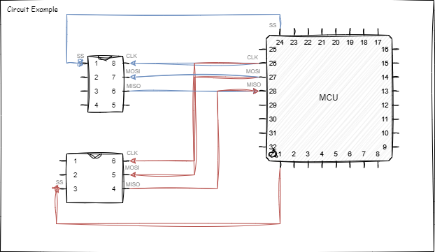
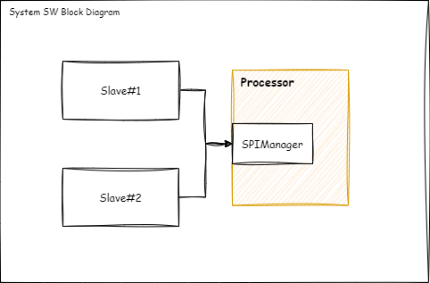
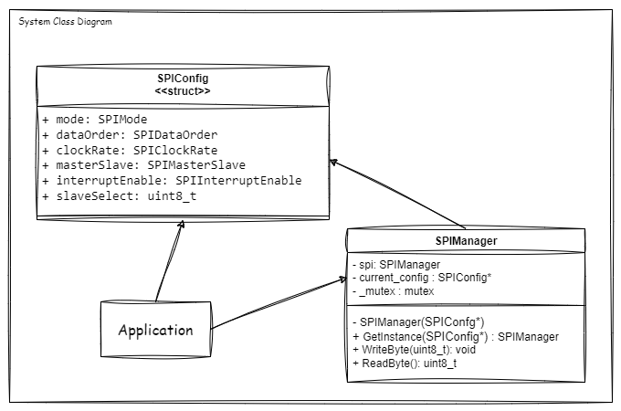

# Requirements
We are developing a system that requires communication with multiple SPI devices. The system has a single SPI peripheral but needs to handle two SPI slaves, each with distinct configurations. To ensure efficient and safe access to the SPI bus, we will implement a Singleton design pattern for the SPI controller.

1. ***Single Instance Guarantee:***
- Ensure that there is only one instance of the SPI controller throughout the application.
- Provide a global point of access to this single instance.

2. ***Thread Safety:***
- Implement mechanisms to prevent race conditions and ensure safe concurrent access to the SPI bus.

3. ***Multiple Configurations:***
- Support distinct configurations for each of the two SPI slaves.
- Handle configurations switching efficiently and minimize overhead and complexity.

---
## Block Diagram

## Class Diagram 

