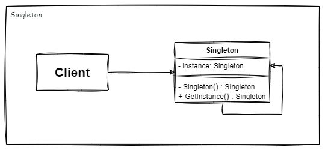

# Table of content

1. [Introduction](#introduction)
2. [When to use](#when-to-use)
3. [When not to use](#when-not-to-use)

 --------
# Singleton 1️⃣
## Introduction

The Singleton design pattern is a creational pattern that ensures a class has only one instance and provides a global point of access to that instance. This pattern is particularly useful when exactly one object is needed to coordinate actions across the system.

**How It Works?**

 1.  **Constructor Is Private**: Create the class that you want to implement as a Singleton. Ensure the constructor is private to prevent direct instantiation.
 2. **Prevent Copying**: Singleton should not be clone-able and assignable. This can be achieved by deleting the copy constructor and assignment operator:
>`Singleton(Singleton &other) = delete; //Copy Constructor`
`void  operator = (const Singleton &) = delete; //Assignement operator`

 3.   **Private Static Field**: Add a private static field in the class to hold the Singleton instance.
 4. **Public Static Method**: Declare a public static method that implements lazy initialization by creating and storing the instance on its first call, then returning it on subsequent calls.
 5. **Add Methods and Attributes**: Include any necessary methods and attributes in the Singleton class, which can be either public or private
 6. **Thread Safety**: If thread safety is required (common in multithreaded applications), ensure the `getInstance` method handles concurrent access properly: 
	 -> You need to ensure that `getInstance` doesn't get in race condition situations.
	 -> Also, make sure that all your specific functions that access mutable Singleton's state to be thread-safe. 

## When to use:✅
- **Global state:** When a class in your program should have just a single instance available to all clients.
- **Caching:** Implementing a caching mechanism where a single instance provides a consistent and centralized cache.

## When not to use:❌
If you can't handle these issues, Don't use singleton:
- **Tight Coupling:** When using a Singleton leads to tight coupling between classes, making the system harder to maintain and test.
- **Testing difficulties:** Singletons can make unit testing difficult because they hold state and can be hard to mock or reset.
- **Tests can become unreliable** due to the shared state in Singletons, leading to flaky tests that depend on the order of execution.
- **Resource Lifetime:** Managing the lifetime of the Singleton can be tricky, especially in resource-constrained environments or when dealing with resource cleanup.

